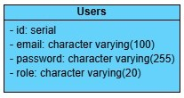
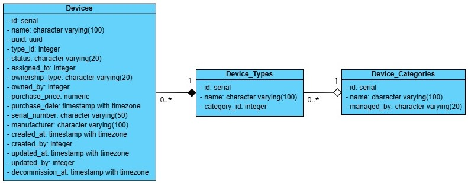

# Equipment Management System

## 1. Objective
To design, develop, and deliver a **microservices-based RESTful API** that enables company-wide equipment management. The system is decomposed into independent services for authentication, device CRUD operations, request/approval workflows, and reporting, each running in its own container.


## 2. Scope of Work
The project will be composed of the following microservices:

- **Auth Service** - handles user login, JWT generation, and role-based access.  
- **Device Service** - manages CRUD operations on devices.  
- **Request Service** - manages device requests and approval/rejection workflows.  
- **Report Service** - generates monthly reports for Admins.  

> All services will communicate via REST APIs and will be exposed through an API Gateway.

## 3. API Endpoints

1. **Auth Service**

- **Login**
    - **Name:** `/login`  
    - **Endpoint:** `/auth/login`  
    - **Method:** `POST`  
    - **Description:** Authenticates a user and returns a JWT token on success.  
    - **Request Body:**
    ```json
    {
        "email": "admin@example.com",
        "password": "12345678"
    }
    ```
    - **Responses**:  
    - **Success**:  
    ```json
    {
        "status": "success",
        "token": "eyJhbGciOiJIUzI1NiJ9..."
    }
    ```  
    - **Fail**:  
    - **Invalid input** - Returned when email or password is null 
     ```json
    {
        "status": "error",
        "statusCode": 1001,
        "message": "Email and password are required"
    }
     ```

    - **Invalid info** - Returned when the input email or password is incorrect
     ```json
    { 
        "status": "error",
        "statusCode": 1002,
        "message": "Email or password is incorrect"
    }
     ```

2. **Device Service**

- **Add Device**
    - **Name:** `/addDevice`  
    - **Endpoint:** `/device`  
    - **Method:** `POST`  
    - **Description:** Adds a new device to the system (admin/IT only).
    - **Request Body:**
    ```json
    {
        "name": "Laptop Dell XPS 15",
        "type": "Laptop"
    }
    ```
    - **Responses**:  
    - **Success**:  
    ```json
    {
        "status": "success",
        "id": 16
    }
    ```  
    - **Fail**:  
    - **Invalid token** - Returned when the JWT token is missing, invalid, or expired
     ```json
    {
        "status": "error",
        "statusCode": 1004,
        "message": "Token is invalid or expired"
    }
     ```

    - **Unauthorized** - Returned when the user does not have permission to perform the requested operation
     ```json
    {
        "status": "error",
        "statusCode": 1005,
        "message": "Insufficient permissions"
    }
     ``` 

    - **Invalid input** - Returned when one or more fields of request body are blank or null
     ```json
    {
        "status": "error",
        "statusCode": 1003,
        "message": "Missing required fields"
    }
     ```

     - **Invalid type** - Returned when the input type is not found or inaccessible
     ```json
    {
        "status": "error",
        "statusCode": 1006,
        "message": "Device type not found or inaccessible"
    }
     ```

- **Update Device**
    - **Name:** `/updateDevice`  
    - **Endpoint:** `/device/{id}`  
    - **Method:** `PUT`  
    - **Description:** Update a device in the system (admin/IT only).
    - **Request Body:**
    ```json
    {
        "name": "Laptop Dell XPS 15",
        "type": "Laptop"
    }
    ```
    - **Responses**:  
    - **Success**:  
    ```json
    {
        "status": "success",
        "id": 16
    }
    ```  
    - **Fail**:  
    - **Invalid token** - Returned when the JWT token is missing, invalid, or expired
     ```json
    {
        "status": "error",
        "statusCode": 1004,
        "message": "Token is invalid or expired"
    }
     ```

    - **Unauthorized** - Returned when the user does not have permission to perform the requested operation
     ```json
    {
        "status": "error",
        "statusCode": 1005,
        "message": "Insufficient permissions"
    }
     ``` 

    - **Not found** - Returned when device ID is not found
     ```json
    {
        "status": "error",
        "statusCode": 1007,
        "message": "Device not found"
    }
     ```

    - **Invalid input** - Returned when one or more fields of request body are blank or null
     ```json
    {
        "status": "error",
        "statusCode": 1003,
        "message": "Missing required fields"
    }
     ```

     - **Invalid type** - Returned when the input type is not found or inaccessible
     ```json
    {
        "status": "error",
        "statusCode": 1006,
        "message": "Device type not found or inaccessible"
    }
     ```

- **View Device**
    - **Name:** `/viewDevice`  
    - **Endpoint:** `/device/{id}`  
    - **Method:** `GET`  
    - **Description:** View a device in the system (admin/IT only).
    - **Responses**:  
    - **Success**:  
    ```json
    {
        "status": "success",
        "device": {
            "id": 16,
            "uuid": "d1e8f080-9bfc-4b9b-a65f-2c5a04a5616d",
            "name": "Laptop Dell XPS 15",
            "type": "Laptop",
            "status": "AVAILABLE",
            "assignedTo": null
        }
    }
    ```  
    - **Fail**:  
    - **Invalid token** - Returned when the JWT token is missing, invalid, or expired
     ```json
    {
        "status": "error",
        "statusCode": 1004,
        "message": "Token is invalid or expired"
    }
     ```

    - **Unauthorized** - Returned when the user does not have permission to perform the requested operation
     ```json
    {
        "status": "error",
        "statusCode": 1005,
        "message": "Insufficient permissions"
    }
     ``` 

    - **Not found** - Returned when device ID is not found
     ```json
    {
        "status": "error",
        "statusCode": 1007,
        "message": "Device not found"
    }
     ```

    - **Inaccessible** - Returned when the user does not have permission to access the specified device
     ```json
    {
        "status": "error",
        "statusCode": 1008,
        "message": "Device inaccessible"
    }
     ```

- **Search devices**
    - **Name:** `/searchDevices`  
    - **Endpoint:** `/device/search`  
    - **Method:** `GET`  
    - **Description:** Search devices based on device name or type.
    - **Responses**:  
    - **Success**:  
    ```json
    {
        "status": "success",
        "results": [

            {
                "uuid": "745571f6-d52b-49ef-88cb-db0607853107",
                "name": "Laptop Dell XPS 30",
                "type": "Laptop",
                "status": "AVAILABLE"
            }
        ]
    }
    ```  
    - **Fail**:  
    - **Invalid token** - Returned when the JWT token is missing, invalid, or expired
     ```json
    {
        "status": "error",
        "statusCode": 1004,
        "message": "Token is invalid or expired"
    }
     ```

- **Decommission device**
    - **Name:** `/decommissionDevice`  
    - **Endpoint:** `/device/{id}`  
    - **Method:** `DELETE`  
    - **Description:** Update a device's status to be 'DECOMMISSION' in the system (admin/IT only).
    - **Responses**:  
    - **Success**:  
    ```json
    {
        "status": "success",
        "id": 16
    }
    ```  
    - **Fail**:  
    - **Invalid token** - Returned when the JWT token is missing, invalid, or expired
     ```json
    {
        "status": "error",
        "statusCode": 1004,
        "message": "Token is invalid or expired"
    }
     ```

    - **Unauthorized** - Returned when the user does not have permission to perform the requested operation
     ```json
    {
        "status": "error",
        "statusCode": 1005,
        "message": "Insufficient permissions"
    }
     ``` 

    - **Not found** - Returned when device ID is not found
     ```json
    {
        "status": "error",
        "statusCode": 1007,
        "message": "Device not found"
    }
     ```

    - **Inaccessible** - Returned when the user does not have permission to access the specified device
     ```json
    {
        "status": "error",
        "statusCode": 1008,
        "message": "Device inaccessible"
    }
     ```
     
3. **Request Service**

- **Create Request**
    - **Name:** `/createRequest`  
    - **Endpoint:** `/request`  
    - **Method:** `POST`  
    - **Description:** Create a new request for a device.
    - **Request Body:**
    ```json
    {
        "uuid": "745571f6-d52b-49ef-88cb-db0607853107",
        "reason": "Laptop broke"
    }
    ```
    - **Responses**:  
    - **Success**:  
    ```json
    {
        "status": "success",
        "requestId": 1
    }
    ```  
    - **Fail**:  
    - **Invalid token** - Returned when the JWT token is missing, invalid, or expired
     ```json
    {
        "status": "error",
        "statusCode": 1004,
        "message": "Token is invalid or expired"
    }
     ```

    - **Invalid UUID** - Returned when request UUID is invalid
     ```json
    {
        "status": "error",
        "statusCode": 1012,
        "message": "Invalid UUID"
    }
     ```

    - **Not found** - Returned when device is not found
     ```json
    {
        "status": "error",
        "statusCode": 1006,
        "message": "Device not found"
    }
     ```

    - **Device unavailable** - Returned when request device is in use or unavailable 
     ```json
    {
        "status": "error",
        "statusCode": 1011,
        "message": "Device is currently in use or unavailable"
    }
     ```

- **View My Requests**
    - **Name:** `/viewMyRequests`  
    - **Endpoint:** `/request`  
    - **Method:** `GET`  
    - **Description:** View all requests submitted by the user.
    - **Responses**:  
    - **Success**:  
    ```json
    {
        "status": "success",
        "requests": [
            {
                "id": 1,
                "deviceUuid": "745571f6-d52b-49ef-88cb-db0607853107",
                "reason": "Laptop broke",
                "status": "PENDING",
                "createdAt": "2025-09-26T07:20:43.324779Z",
                "updatedAt": "2025-09-26T07:20:43.324779Z"
            }
        ]
    }
    ```  
    - **Fail**:  
    - **Invalid token** - Returned when the JWT token is missing, invalid, or expired
     ```json
    {
        "status": "error",
        "statusCode": 1004,
        "message": "Token is invalid or expired"
    }
     ```

- **View Pending Request**
    - **Name:** `/viewPendingRequest`  
    - **Endpoint:** `/pending/{id}`  
    - **Method:** `GET`  
    - **Description:** View a pending request that require the user approval (admin/IT only).
    - **Request Body:**
    - **Responses**:  
    - **Success**:  
    ```json
    {
        "status": "success",
        "requests": [
            {
                "id": 1,
                "deviceUuid": "745571f6-d52b-49ef-88cb-db0607853107",
                "requesterId": 3,
                "reason": "Laptop broke",
                "status": "PENDING",
                "createdAt": "2025-09-26T07:20:43.324779Z"
            }
        ]
    }
    ```  
    - **Fail**:  
    - **Invalid token** - Returned when the JWT token is missing, invalid, or expired
     ```json
    {
        "status": "error",
        "statusCode": 1004,
        "message": "Token is invalid or expired"
    }
     ```

    - **Unauthorized** - Returned when the user does not have permission to perform the requested operation
     ```json
    {
        "status": "error",
        "statusCode": 1005,
        "message": "Insufficient permissions"
    }
     ``` 

    - **Request not found** - Returned when request is not found
     ```json
    {
        "status": "error",
        "statusCode": 1009,
        "message": "Request not found"
    }
     ```

    - **Invalid operation** - Returned when the request is in a state that does not allow the requested operation
     ```json
    {
        "status": "error",
        "statusCode": 1010,
        "message": "Request not in a valid state for this action"
    }
     ```

- **View All Pending Requests**
    - **Name:** `/viewAllPendingRequests`  
    - **Endpoint:** `/request/pending`  
    - **Method:** `GET`  
    - **Description:** View all pending requests that require the user approval (admin/IT only).
    - **Responses**:  
    - **Success**:  
    ```json
    {
        "status": "success",
        "requests": [
            {
                "id": 1,
                "deviceUuid": "745571f6-d52b-49ef-88cb-db0607853107",
                "requesterId": 3,
                "reason": "Laptop broke",
                "status": "PENDING",
                "createdAt": "2025-09-26T07:20:43.324779Z"
            }
        ]
    }
    ```  
    - **Fail**:  
    - **Invalid token** - Returned when the JWT token is missing, invalid, or expired
     ```json
    {
        "status": "error",
        "statusCode": 1004,
        "message": "Token is invalid or expired"
    }
     ```

    - **Unauthorized** - Returned when the user does not have permission to perform the requested operation
     ```json
    {
        "status": "error",
        "statusCode": 1005,
        "message": "Insufficient permissions"
    }
     ``` 

- **Resolve Request**
    - **Name:** `/resolveRequest`  
    - **Endpoint:** `/request/pending/{id}`  
    - **Method:** `POST`  
    - **Description:** Approve or deny a pending request and update device status accordingly (admin/IT only).
    - **Request Body:**
    ```json
    {
        "approve": true,
        "comment": "Approved"
    }
    ```
    - **Responses**:  
    - **Success**:  
    ```json
    {
        "status": "success",
        "requestId": 1
    }
    ```  
    - **Fail**:  
    - **Invalid token** - Returned when the JWT token is missing, invalid, or expired
     ```json
    {
        "status": "error",
        "statusCode": 1004,
        "message": "Token is invalid or expired"
    }
     ```

    - **Unauthorized** - Returned when the user does not have permission to perform the requested operation
     ```json
    {
        "status": "error",
        "statusCode": 1005,
        "message": "Insufficient permissions"
    }
     ``` 

    - **Request not found** - Returned when request is not found 
     ```json
    {
        "status": "error",
        "statusCode": 1009,
        "message": "Request not found"
    }
     ```

    - **Invalid operation** - Returned when the request is in a state that does not allow the requested operation
     ```json
    {
        "status": "error",
        "statusCode": 1010,
        "message": "Request not in a valid state for this action"
    }
     ```

    - **Device unavailable** - Returned when request device is in use or unavailable 
     ```json
    {
        "status": "error",
        "statusCode": 1011,
        "message": "Device is currently in use or unavailable"
    }
     ```

- **Submit Close Request**
    - **Name:** `/submitCloseRequest`  
    - **Endpoint:** `/request/request-close/{id}`  
    - **Method:** `POST`  
    - **Description:** Submit a request to close an approved request.
    - **Responses**:  
    - **Success**:  
    ```json
    {
        "status": "success",
        "requestId": 1
    }
    ```  
    - **Fail**:  
    - **Invalid token** - Returned when the JWT token is missing, invalid, or expired
     ```json
    {
        "status": "error",
        "statusCode": 1004,
        "message": "Token is invalid or expired"
    }
     ```

    - **Request not found** - Returned when request is not found 
     ```json
    {
        "status": "error",
        "statusCode": 1009,
        "message": "Request not found"
    }
     ```

    - **Unauthorized** - Returned when the user attempts to submit a close notice on a request they did not create.
     ```json
    {
        "status": "error",
        "statusCode": 1005,
        "message": "Insufficient permissions"
    }
     ``` 

    - **Invalid operation** - Returned when the request is in a state that does not allow the requested operation
     ```json
    {
        "status": "error",
        "statusCode": 1010,
        "message": "Request not in a valid state for this action"
    }
     ```

    - **Already requested close** - Returned when a close notice has already been submitted for the request.
     ```json
    {
        "status": "error",
        "statusCode": 1013,
        "message": "Request not in a valid state for this action"
    }
     ```
    
- **View Closable Request**
    - **Name:** `/viewClosableRequest`  
    - **Endpoint:** `/request/close/{id}`  
    - **Method:** `GET`  
    - **Description:** View a request that is eligible for closure by the user (admin/IT only).
    - **Responses**:  
    - **Success**:  
    ```json
    {
        "status": "success",
        "requests": [
            {
                "id": 13,
                "deviceUuid": "35766d0a-f35b-466a-b112-2bc86e874200",
                "requesterId": 3,
                "reason": "Need new switch",
                "status": "APPROVED",
                "createdAt": "2025-09-30T06:37:05.252951Z",
                "processedByManager": 1,
                "managerProcessedAt": "2025-09-30T06:38:05.263316Z",
                "managerComment": "Approved",
                "processedByIt": 5,
                "itProcessedAt": "2025-10-02T03:45:01.482864Z",
                "itComment": "IT approved",
                "requestedToCloseAt": "2025-10-02T08:20:06.752053Z"
            }
        ]
    }
    ```  
    - **Fail**:  
    - **Invalid token** - Returned when the JWT token is missing, invalid, or expired
     ```json
    {
        "status": "error",
        "statusCode": 1004,
        "message": "Token is invalid or expired"
    }
     ```

    - **Unauthorized** - Returned when the user does not have permission to perform the requested operation
     ```json
    {
        "status": "error",
        "statusCode": 1005,
        "message": "Insufficient permissions"
    }
     ``` 

    - **Request not found** - Returned when request is not found 
     ```json
    {
        "status": "error",
        "statusCode": 1009,
        "message": "Request not found"
    }
     ```

    - **Invalid operation** - Returned when the request is in a state that does not allow the requested operation
     ```json
    {
        "status": "error",
        "statusCode": 1010,
        "message": "Request not in a valid state for this action"
    }
     ```

- **View All Closable Requests**
    - **Name:** `/viewAllClosableRequests`  
    - **Endpoint:** `/request/close`  
    - **Method:** `GET`  
    - **Description:** View all requests that are eligible for closure by the user (admin/IT only).
    - **Responses**:  
    - **Success**:  
    ```json
    {
        "status": "success",
        "requests": [
            {
                "id": 13,
                "deviceUuid": "35766d0a-f35b-466a-b112-2bc86e874200",
                "requesterId": 3,
                "reason": "Need new switch",
                "status": "APPROVED",
                "createdAt": "2025-09-30T06:37:05.252951Z",
                "processedByManager": 1,
                "managerProcessedAt": "2025-09-30T06:38:05.263316Z",
                "managerComment": "Approved",
                "processedByIt": 5,
                "itProcessedAt": "2025-10-02T03:45:01.482864Z",
                "itComment": "IT approved",
                "requestedToCloseAt": "2025-10-02T08:20:06.752053Z"
            }
        ]
    }
    ```  
    - **Fail**:  
    - **Invalid token** - Returned when the JWT token is missing, invalid, or expired
     ```json
    {
        "status": "error",
        "statusCode": 1004,
        "message": "Token is invalid or expired"
    }
     ```

    - **Unauthorized** - Returned when the user does not have permission to perform the requested operation
     ```json
    {
        "status": "error",
        "statusCode": 1005,
        "message": "Insufficient permissions"
    }
     ``` 


- **Close Request**
    - **Name:** `/closeRequest`  
    - **Endpoint:** `/request/close/{id}`  
    - **Method:** `GET`  
    - **Description:** Close a request that has been marked for closure (admin/IT only).
    - **Responses**:  
    - **Success**:  
    ```json
    {
        "status": "success",
        "requestId": 13
    }
    ```  
    - **Fail**:  
    - **Invalid token** - Returned when the JWT token is missing, invalid, or expired
     ```json
    {
        "status": "error",
        "statusCode": 1004,
        "message": "Token is invalid or expired"
    }
     ```

    - **Unauthorized** - Returned when the user does not have permission to perform the requested operation
     ```json
    {
        "status": "error",
        "statusCode": 1005,
        "message": "Insufficient permissions"
    }
     ``` 

    - **Request not found** - Returned when request is not found 
     ```json
    {
        "status": "error",
        "statusCode": 1009,
        "message": "Request not found"
    }
     ```

    - **Invalid operation** - Returned when the request is in a state that does not allow the requested operation
     ```json
    {
        "status": "error",
        "statusCode": 1010,
        "message": "Request not in a valid state for this action"
    }
     ```

- **View My Processed Requests**
    - **Name:** `/viewMyProcessedRequests`  
    - **Endpoint:** `/request/processed`  
    - **Method:** `GET`  
    - **Description:** View all requests that the user has processed or closed (admin/IT only).
    - **Responses**:  
    - **Success**:  
    ```json
    {
        "status": "success",
        "requests": [
            {
                "id": 13,
                "deviceUuid": "35766d0a-f35b-466a-b112-2bc86e874200",
                "requesterId": 3,
                "reason": "Need new switch",
                "status": "CLOSED",
                "createdAt": "2025-09-30T06:37:05.252951Z",
                "processedByManager": 1,
                "managerProcessedAt": "2025-09-30T06:38:05.263316Z",
                "managerComment": "Approved",
                "processedByIt": 5,
                "itProcessedAt": "2025-10-02T03:45:01.482864Z",
                "itComment": "IT approved",
                "requestedToCloseAt": "2025-10-02T08:20:06.752053Z",
                "closeAt": "2025-10-02T08:44:32.066074Z"
            }
        ]
    }
    ```  
    - **Fail**:  
    - **Invalid token** - Returned when the JWT token is missing, invalid, or expired
     ```json
    {
        "status": "error",
        "statusCode": 1004,
        "message": "Token is invalid or expired"
    }
     ```

    - **Unauthorized** - Returned when the user does not have permission to perform the requested operation
     ```json
    {
        "status": "error",
        "statusCode": 1005,
        "message": "Insufficient permissions"
    }
     ``` 


## 4. Milestones & Time Frames
- **Time Frame:** 4 weeks  
- **Start Date:** 8 September, 2025  

| Date Range | Milestone | Description |
|------------|-----------|-------------|
| 08/09 - 09/09 | Project Setup and Planning | Define microservice boundaries, create repositories |
| 10/09 - 12/09 | Auth Service | Build authentication & authorization service with JWT. |
| 13/09 - 16/09 | Device Service | Implement device CRUD microservice, expose REST endpoints. |
| 17/09 - 20/09 | Request Service | Implement request handling microservice for employees and IT/Admin approvals. |
| 21/09 - 23/09 | Report Service | Build reporting microservice for monthly device overview. |
| 24/09 - 26/09 | Service Integration | Test inter-service communication, validate role-based flows. |
| 27/09 - 30/09 | System Testing | End-to-end testing across all microservices. |
| 01/10 - 03/10 | API Documentation | Document APIs of each service and prepare Postman collection. |
| 04/10 - 05/10 | Deployment and Review | Deploy multi-service system with Docker Compose. |


## 5. Database Design
Each service will use its own database for storing and managing data related to its responsibilities.  

- **Auth Service DB** - manages user accounts, credentials, and roles.


  > User role: 'ADMIN', 'EMPLOYEE', 'IT'

- **Device Service DB** - manages all device records, status, and assignment information.


  > Device category: 'GENERAL', 'NETWORK'
  
  > Device status: 'AVAILABLE', 'RESERVED', 'ASSIGNED', 'MAINTENANCE', 'RETIRED'
  
  > Device ownership type: 'COMPANY', 'BYOD'

- **Request Service DB** - manages device requests, approvals, rejections, and workflow history.


  > Request type: 'ASSIGN', 'REGISTER'

  > Request status: 'PENDING', 'REJECTED', 'APPROVED', 'DELIVERED', 'CLOSED', 'CANCELLED'

- **Report Service DB** - stores aggregated data and reporting snapshots.  


## 6. Workflow Overview

The following diagram illustrates the complete equipment request lifecycle, from submission and approval to device delivery and closure, involving interactions between multiple services.


## 7. Setup & Testing

1. **Build the Application**

Run the following command in the root folder of each of the services to build the Spring Boot JAR file:

```bash
./gradlew build
```

> Use `-x test` to skip running tests for faster image build

2. **Create the Network**

Run the following command in the terminal to create the network used by the containers:

```bash
docker network create equipment-management-net
```

To stop and remove the network:
```bash
docker network rm equipment-management-net
```

3. **Start the Application**

Run the following command in the root folder of each of the service to start both the application and database:

```bash
docker compose -f deploy/compose.yml up
```

To stop the containers and remove associated volumes:
```bash
docker compose -f deploy/compose.yml down -v
```


## 8. Technical Specifications
- **Architecture:** Microservices architecture with independent services (Auth, Device, Request, Report).  
- **Service Communication:** REST APIs with an API Gateway.  
- **Containerization:** Each service runs in its own Docker container.  
- **Persistence:** Independent PostgreSQL databases per service.  
- **Scalability:** Services can be scaled independently.  
- **Frameworks:** Java / Spring Boot for each service.  
- **Authentication:** Centralized Auth service for JWT issuance, Gateway validates and routes requests. 
