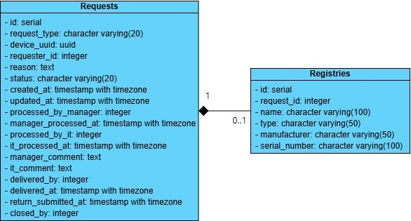

# Equipment Management System

## 1. Objective
To design, develop, and deliver a **microservices-based RESTful API** that enables company-wide equipment management. The system is decomposed into independent services for authentication, device CRUD operations, request/approval workflows, and reporting, each running in its own container.


## 2. Scope of Work
The project will be composed of the following microservices:

- **Auth Service** - handles user login, JWT generation, and role-based access.
- **Device Service** - manages CRUD operations on devices.
- **Request Service** - manages device requests and approval/rejection workflows.
- **Report Service** - generates monthly reports for Admins.

> All services will communicate via REST APIs and will be exposed through an API Gateway.

## 3. API Endpoints

### 1. **Auth Service**

- **Login**
    - **Name:** `/login`
    - **Endpoint:** `/auth/login`
    - **Method:** `POST`
    - **Description:** Authenticates a user and returns a JWT token on success.
    - **Request Body:**
    ```json
    {
        "email": "admin@example.com",
        "password": "12345678"
    }
    ```
    - **Responses**:
    - **Success**:
    ```json
    {
        "status": "success",
        "token": "eyJhbGciOiJIUzI1NiJ9..."
    }
    ```  
    - **Fail**:
    - **Invalid input** - Returned when email or password is null
     ```json
    {
        "status": "error",
        "statusCode": 1001,
        "message": "Email and password are required"
    }
     ```

    - **Invalid info** - Returned when the input email or password is incorrect
     ```json
    { 
        "status": "error",
        "statusCode": 1002,
        "message": "Email or password is incorrect"
    }
     ```

### 2. **Device Service**

- **Add Device**
    - **Name:** `/addDevice`
    - **Endpoint:** `/device`
    - **Method:** `POST`
    - **Description:** Adds a new device to the system (admin/IT only).
    - **Request Body:**
    ```json
    {
        "name": "Dell XPS 15",
        "type": "Laptop",
        "serialNumber": "SN-DEL-1001",
        "manufacturer": "Dell",
        "purchasePrice": 1800.00,
        "purchaseDate": "2023-08-14"
    }
    ```
    - **Responses**:
    - **Success**:
    ```json
    {
        "status": "success",
        "id": 16
    }
    ```  
    - **Fail**:
    - **Invalid token** - Returned when the JWT token is missing, invalid, or expired
     ```json
    {
        "status": "error",
        "statusCode": 1004,
        "message": "Token is invalid or expired"
    }
     ```

    - **Unauthorized** - Returned when the user does not have permission to perform the requested operation
     ```json
    {
        "status": "error",
        "statusCode": 1005,
        "message": "Insufficient permissions"
    }
     ``` 

    - **Missing fields** - Returned when one or more required fields of request body are blank or null
     ```json
    {
        "status": "error",
        "statusCode": 1003,
        "message": "Missing required fields"
    }
     ```

    - **Type not found** - Returned when the input type is not found
     ```json
    {
        "status": "error",
        "statusCode": 1016,
        "message": "Device type not found"
    }
     ```

    - **Type inaccessible** - Returned when the user is not authorized to access the input type
     ```json
    {
        "status": "error",
        "statusCode": 1006,
        "message": "You are not authorized to access this device type"
    }
     ```

    - **Duplicate serial** - Returned when the input serial already exists
     ```json
    {
        "status": "error",
        "statusCode": 1015,
        "message": "Serial number already exists"
    }
     ```

    - **Invalid date** - Returned when the input date is not the correct format
     ```json
    {
        "status": "error",
        "statusCode": 1014,
        "message": "Date must be in format yyyy-MM-dd"
    }
     ```


- **Update Device**
    - **Name:** `/updateDevice`
    - **Endpoint:** `/device/{id}`
    - **Method:** `PUT`
    - **Description:** Update a device in the system (admin/IT only).
    - **Request Body:**
    ```json
    {
        "name": "Dell XPS 16 2024",
        "type": "Laptop",
        "serialNumber": "SN-DEL-1001",
        "manufacturer": "Dell",
        "purchasePrice": 1800.00,
        "purchaseDate": "2023-08-14"
    }
    ```
    - **Responses**:
    - **Success**:
    ```json
    {
        "status": "success",
        "id": 16
    }
    ```  
    - **Fail**:
    - **Invalid token** - Returned when the JWT token is missing, invalid, or expired
     ```json
    {
        "status": "error",
        "statusCode": 1004,
        "message": "Token is invalid or expired"
    }
     ```

    - **Unauthorized** - Returned when the user does not have permission to perform the requested operation
     ```json
    {
        "status": "error",
        "statusCode": 1005,
        "message": "Insufficient permissions"
    }
     ``` 

    - **Not found** - Returned when device ID is not found
     ```json
    {
        "status": "error",
        "statusCode": 1007,
        "message": "Device not found"
    }
     ```

    - **Invalid operation** - Returned when device status is not in a valid for this operation
     ```json
    {
        "status": "error",
        "statusCode": 1017,
        "message": "Device not in a valid state for this action"
    }
     ```

    - **Missing fields** - Returned when one or more required fields of request body are blank or null
     ```json
    {
        "status": "error",
        "statusCode": 1003,
        "message": "Missing required fields"
    }
     ```

    - **Invalid type** - Returned when the input type is not found
     ```json
    {
        "status": "error",
        "statusCode": 1016,
        "message": "Device type not found"
    }
     ```

    - **Type inaccessible** - Returned when the user is not authorized to access the input type
     ```json
    {
        "status": "error",
        "statusCode": 1006,
        "message": "You are not authorized to access this device type"
    }
     ```

    - **Duplicate serial** - Returned when the input serial already exists
     ```json
    {
        "status": "error",
        "statusCode": 1015,
        "message": "Serial number already exists"
    }
     ```

    - **Invalid date** - Returned when the input date is not the correct format
     ```json
    {
        "status": "error",
        "statusCode": 1014,
        "message": "Date must be in format yyyy-MM-dd"
    }
     ```

- **View Device**
    - **Name:** `/viewDevice`
    - **Endpoint:** `/device/{id}`
    - **Method:** `GET`
    - **Description:** View a device in the system (admin/IT only).
    - **Responses**:
    - **Success**:
    ```json
    {
        "status": "success",
        "device": {
            "id": 16,
            "uuid": "b436a16d-4906-45a7-88a9-6d14d2148f2e",
            "name": "Dell XPS 15",
            "type": "Laptop",
            "ownershipType": "COMPANY",
            "serialNumber": "SN-DEL-1001",
            "manufacturer": "Dell",
            "purchasePrice": 1800.00,
            "purchaseDate": "2023-08-14T17:00:00Z",
            "status": "AVAILABLE",
            "createdAt": "2025-09-23T03:24:36.304667Z",
            "createdBy": 1,
            "updatedAt": "2025-10-23T03:19:20.724718Z",
            "updatedBy": 1
        }
    }
    ```  
    - **Fail**:
    - **Invalid token** - Returned when the JWT token is missing, invalid, or expired
     ```json
    {
        "status": "error",
        "statusCode": 1004,
        "message": "Token is invalid or expired"
    }
     ```

    - **Unauthorized** - Returned when the user does not have permission to perform the requested operation
     ```json
    {
        "status": "error",
        "statusCode": 1005,
        "message": "Insufficient permissions"
    }
     ``` 

    - **Not found** - Returned when device ID is not found
     ```json
    {
        "status": "error",
        "statusCode": 1007,
        "message": "Device not found"
    }
     ```

    - **Inaccessible** - Returned when the user does not have permission to access the specified device
     ```json
    {
        "status": "error",
        "statusCode": 1008,
        "message": "You are not authorized to access this device"
    }
     ```

- **Search devices**
    - **Name:** `/searchDevices`
    - **Endpoint:** `/device/search`
    - **Method:** `GET`
    - **Description:** Search devices based on device name or type.
    - **Responses**:
    - **Success**:
    ```json
    {
        "status": "success",
        "page": 1,
        "size": 10,
        "totalItems": 1,
        "results": [
            {
                "uuid": "b436a16d-4906-45a7-88a9-6d14d2148f2e",
                "name": "Dell XPS 15",
                "type": "Laptop",
                "category": "GENERAL",
                "manufacturer": "Dell",
                "status": "AVAILABLE",
                "updatedAt": "2025-10-23T03:19:20.724718Z"
            }
        ]
    }
    ```  
    - **Fail**:
    - **Invalid token** - Returned when the JWT token is missing, invalid, or expired
     ```json
    {
        "status": "error",
        "statusCode": 1004,
        "message": "Token is invalid or expired"
    }
     ```

- **Update device maintenance**
    - **Name:** `/updateDeviceMaintenance`
    - **Endpoint:** `/device/maintenance/{id}`
    - **Method:** `PUT`
    - **Description:** Update a device's status to be 'MAINTENANCE' in the system (admin/IT only).
    - **Request Body:**
    ```json
    {
        "maintenance": true
    }
    ```
    - **Responses**:
    - **Success**:
    ```json
    {
        "status": "success",
        "id": 16
    }
    ```  
    - **Fail**:
    - **Invalid token** - Returned when the JWT token is missing, invalid, or expired
     ```json
    {
        "status": "error",
        "statusCode": 1004,
        "message": "Token is invalid or expired"
    }
     ```

    - **Unauthorized** - Returned when the user does not have permission to perform the requested operation
     ```json
    {
        "status": "error",
        "statusCode": 1005,
        "message": "Insufficient permissions"
    }
     ``` 

    - **Not found** - Returned when device ID is not found
     ```json
    {
        "status": "error",
        "statusCode": 1007,
        "message": "Device not found"
    }
     ```

    - **Missing fields** - Returned when one or more required fields of request body are blank or null
     ```json
    {
        "status": "error",
        "statusCode": 1003,
        "message": "Missing required fields"
    }
     ```

    - **Inaccessible** - Returned when the user does not have permission to access the specified device
     ```json
    {
        "status": "error",
        "statusCode": 1008,
        "message": "You are not authorized to access this device"
    }
     ```

    - **Invalid operation** - Returned when device status is not in a valid for this operation
     ```json
    {
        "status": "error",
        "statusCode": 1017,
        "message": "Device not in a valid state for this action"
    }
     ```

- **Decommission device**
    - **Name:** `/decommissionDevice`
    - **Endpoint:** `/device/{id}`
    - **Method:** `DELETE`
    - **Description:** Update a device's status to be 'RETIRED' in the system (admin/IT only).
    - **Responses**:
    - **Success**:
    ```json
    {
        "status": "success",
        "id": 16
    }
    ```  
    - **Fail**:
    - **Invalid token** - Returned when the JWT token is missing, invalid, or expired
     ```json
    {
        "status": "error",
        "statusCode": 1004,
        "message": "Token is invalid or expired"
    }
     ```

    - **Unauthorized** - Returned when the user does not have permission to perform the requested operation
     ```json
    {
        "status": "error",
        "statusCode": 1005,
        "message": "Insufficient permissions"
    }
     ``` 

    - **Not found** - Returned when device ID is not found
     ```json
    {
        "status": "error",
        "statusCode": 1007,
        "message": "Device not found"
    }
     ```

    - **Inaccessible** - Returned when the user does not have permission to access the specified device
     ```json
    {
        "status": "error",
        "statusCode": 1008,
        "message": "You are not authorized to access this device"
    }
     ```

- **View my device**
    - **Name:** `/viewMyDevice`
    - **Endpoint:** `/device/my/{uuid}`
    - **Method:** `GET`
    - **Description:** View a registered BYOD device of the user.
    - **Responses**:
    - **Success**:
    ```json
    {
        "name": "Dell XPS 16 Laptop",
        "type": "Laptop",
        "serialNumber": "SN-LA-1002",
        "manufacturer": "Dell"
    }
    ```  
    - **Fail**:
    - **Invalid token** - Returned when the JWT token is missing, invalid, or expired
     ```json
    {
        "status": "error",
        "statusCode": 1004,
        "message": "Token is invalid or expired"
    }
     ```

    - **Invalid UUID** - Returned when request UUID is invalid
     ```json
    {
        "status": "error",
        "statusCode": 1012,
        "message": "Invalid UUID"
    }
     ```

    - **Not found** - Returned when device ID is not found
     ```json
    {
        "status": "error",
        "statusCode": 1007,
        "message": "Device not found"
    }
     ```

    - **Unauthorized** - Returned when the user does not have permission to perform the requested operation
     ```json
    {
        "status": "error",
        "statusCode": 1005,
        "message": "Insufficient permissions"
    }
     ``` 

- **Unenroll device**
    - **Name:** `/unenrollDevice`
    - **Endpoint:** `/device/by-uuid/{uuid}`
    - **Method:** `DELETE`
    - **Description:** Update the status of a BYOD device to 'RETIRED' (admin/IT only).
    - **Responses**:
    - **Success**:
    ```json
    {
        "name": "Dell XPS 16 Laptop",
        "type": "Laptop",
        "serialNumber": "SN-LA-1002",
        "manufacturer": "Dell"
    }
    ```  
    - **Fail**:
    - **Invalid token** - Returned when the JWT token is missing, invalid, or expired
     ```json
    {
        "status": "error",
        "statusCode": 1004,
        "message": "Token is invalid or expired"
    }
     ```

    - **Unauthorized** - Returned when the user does not have permission to perform the requested operation
     ```json
    {
        "status": "error",
        "statusCode": 1005,
        "message": "Insufficient permissions"
    }
     ``` 

    - **Invalid UUID** - Returned when request UUID is invalid
     ```json
    {
        "status": "error",
        "statusCode": 1012,
        "message": "Invalid UUID"
    }
     ```

    - **Not found** - Returned when device ID is not found
     ```json
    {
        "status": "error",
        "statusCode": 1007,
        "message": "Device not found"
    }
     ```

    - **Inaccessible** - Returned when the user does not have permission to access the specified device
     ```json
    {
        "status": "error",
        "statusCode": 1008,
        "message": "You are not authorized to access this device"
    }
     ```

    - **Invalid operation** - Returned when device status is not in a valid for this operation
     ```json
    {
        "status": "error",
        "statusCode": 1017,
        "message": "Device not in a valid state for this action"
    }
     ```

### 3. **Request Service**

- **Create Request**
    - **Name:** `/createRequest`
    - **Endpoint:** `/request`
    - **Method:** `POST`
    - **Description:** Create a new request for a device.
    - **Request Body:**
    ```json
    {
        "uuid": "745571f6-d52b-49ef-88cb-db0607853107",
        "reason": "Need new laptop for work"
    }
    ```
    - **Responses**:
    - **Success**:
    ```json
    {
        "status": "success",
        "requestId": 1
    }
    ```  
    - **Fail**:
    - **Invalid token** - Returned when the JWT token is missing, invalid, or expired
     ```json
    {
        "status": "error",
        "statusCode": 1004,
        "message": "Token is invalid or expired"
    }
     ```

    - **Invalid UUID** - Returned when request UUID is invalid
     ```json
    {
        "status": "error",
        "statusCode": 1012,
        "message": "Invalid UUID"
    }
     ```

    - **Not found** - Returned when device is not found
     ```json
    {
        "status": "error",
        "statusCode": 1006,
        "message": "Device not found"
    }
     ```

    - **Device unavailable** - Returned when request device is in use or unavailable
     ```json
    {
        "status": "error",
        "statusCode": 1011,
        "message": "Device is currently in use or unavailable"
    }
     ```

- **View My Requests**
    - **Name:** `/viewMyRequests`
    - **Endpoint:** `/request`
    - **Method:** `GET`
    - **Description:** View all requests submitted by the user.
    - **Responses**:
    - **Success**:
    ```json
    {
        "status": "success",
        "requests": [
            {
                "id": 1,
                "deviceUuid": "745571f6-d52b-49ef-88cb-db0607853107",
                "reason": "Laptop broke",
                "status": "PENDING",
                "createdAt": "2025-09-26T07:20:43.324779Z",
                "updatedAt": "2025-09-26T07:20:43.324779Z"
            }
        ]
    }
    ```  
    - **Fail**:
    - **Invalid token** - Returned when the JWT token is missing, invalid, or expired
     ```json
    {
        "status": "error",
        "statusCode": 1004,
        "message": "Token is invalid or expired"
    }
     ```

- **Submit Return Notice**
    - **Name:** `/submitReturnNotice`
    - **Endpoint:** `/request/return/{id}`
    - **Method:** `POST`
    - **Description:** Submit a return notice for admin/IT to confirm.
    - **Responses**:
    - **Success**:
    ```json
    {
        "status": "success",
        "requestId": 1
    }
    ```  
    - **Fail**:
    - **Invalid token** - Returned when the JWT token is missing, invalid, or expired
     ```json
    {
        "status": "error",
        "statusCode": 1004,
        "message": "Token is invalid or expired"
    }
     ```

    - **Request not found** - Returned when request is not found
     ```json
    {
        "status": "error",
        "statusCode": 1009,
        "message": "Request not found"
    }
     ```

    - **Unauthorized** - Returned when the user attempts to submit a close notice on a request they did not create.
     ```json
    {
        "status": "error",
        "statusCode": 1005,
        "message": "Insufficient permissions"
    }
     ``` 

    - **Invalid operation** - Returned when the request is in a state that does not allow the requested operation
     ```json
    {
        "status": "error",
        "statusCode": 1010,
        "message": "Request not in a valid state for this action"
    }
     ```

    - **Already requested close** - Returned when a close notice has already been submitted for the request.
     ```json
    {
        "status": "error",
        "statusCode": 1013,
        "message": "Notice has already been submitted"
    }
     ```

- **Create Registry**
    - **Name:** `/createRegistry`
    - **Endpoint:** `/request/register`
    - **Method:** `POST`
    - **Description:** Create a register request for a BYOD device.
    - **Request Body:**
    ```json
    {
        "name": "Dell XPS 16 Laptop",
        "type": "Laptop",
        "serialNumber": "SN-LA-1002",
        "manufacturer": "Dell",
        "reason": "I use this laptop for work"
    }
    ```
    - **Responses**:
    - **Success**:
    ```json
    {
        "status": "success",
        "requestId": 3
    }
    ```  
    - **Fail**:
    - **Invalid token** - Returned when the JWT token is missing, invalid, or expired
     ```json
    {
        "status": "error",
        "statusCode": 1004,
        "message": "Token is invalid or expired"
    }
     ```

    - **Invalid input** - Returned when one or more fields of request body are blank or null
     ```json
    {
        "status": "error",
        "statusCode": 1003,
        "message": "Missing required fields"
    }
     ```

    - **Type not found** - Returned when the input type is not found
     ```json
    {
        "status": "error",
        "statusCode": 1016,
        "message": "Device type not found"
    }
     ```

    - **Duplicate serial** - Returned when the input serial already exists
     ```json
    {
        "status": "error",
        "statusCode": 1015,
        "message": "Serial number already exists"
    }
     ```

- **View All My Registries**
    - **Name:** `/viewAllMyRegistries`
    - **Endpoint:** `/request/register`
    - **Method:** `GET`
    - **Description:** View all registries submitted by the user.
    - **Responses**:
    - **Success**:
    ```json
    {
        "status": "success",
        "requests": [
            {
                "id": 3,
                "device": [
                    {
                        "name": "Dell XPS 16 Laptop",
                        "type": "Laptop",
                        "serialNumber": "SN-LA-1002",
                        "manufacturer": "Dell"
                    }
                ],
                "reason": "I use this laptop for work",
                "status": "PENDING",
                "createdAt": "2025-09-26T07:20:43.324779Z",
                "updatedAt": "2025-09-26T07:20:43.324779Z"
            }
        ]
    }
    ```  
    - **Fail**:
    - **Invalid token** - Returned when the JWT token is missing, invalid, or expired
     ```json
    {
        "status": "error",
        "statusCode": 1004,
        "message": "Token is invalid or expired"
    }
     ```

- **View My Registry**
    - **Name:** `/viewMyRegistry`
    - **Endpoint:** `/request/register/{id}`
    - **Method:** `GET`
    - **Description:** View a registry submitted by the user.
    - **Responses**:
    - **Success**:
    ```json
    {
        "status": "success",
        "requests": [
            {
                "id": 3,
                "device": [
                    {
                        "name": "Dell XPS 16 Laptop",
                        "type": "Laptop",
                        "serialNumber": "SN-LA-1002",
                        "manufacturer": "Dell"
                    }
                ],
                "reason": "I use this laptop for work",
                "status": "PENDING",
                "createdAt": "2025-09-26T07:20:43.324779Z",
                "updatedAt": "2025-09-26T07:20:43.324779Z"
            }
        ]
    }
    ```  
    - **Fail**:
    - **Invalid token** - Returned when the JWT token is missing, invalid, or expired
     ```json
    {
        "status": "error",
        "statusCode": 1004,
        "message": "Token is invalid or expired"
    }
     ```

    - **Not found** - Returned when device is not found
     ```json
    {
        "status": "error",
        "statusCode": 1006,
        "message": "Device not found"
    }
     ```

    - **Unauthorized** - Returned when the user does not have permission to perform the requested operation
     ```json
    {
        "status": "error",
        "statusCode": 1005,
        "message": "Insufficient permissions"
    }
     ``` 

    - **Registry not found** - Returned when request type is not 'REGISTER'
     ```json
    {
        "status": "error",
        "statusCode": 1018,
        "message": "Request is not a registry"
    }
     ```

- **Submit Unenroll Notice**
    - **Name:** `/submitUnenrollNotice`
    - **Endpoint:** `/request/register/{id}/unenroll`
    - **Method:** `POST`
    - **Description:** Submit an unenroll notice for the user BYOD device.
    - **Responses**:
    - **Success**:
    ```json
    {
        "status": "success",
        "requestId": 3
    }
    ```  
    - **Fail**:
    - **Invalid token** - Returned when the JWT token is missing, invalid, or expired
     ```json
    {
        "status": "error",
        "statusCode": 1004,
        "message": "Token is invalid or expired"
    }
     ```

    - **Request not found** - Returned when request is not found
     ```json
    {
        "status": "error",
        "statusCode": 1009,
        "message": "Request not found"
    }
     ```

    - **Unauthorized** - Returned when the user attempts to submit a close notice on a request they did not create.
     ```json
    {
        "status": "error",
        "statusCode": 1005,
        "message": "Insufficient permissions"
    }
     ``` 

    - **Invalid operation** - Returned when the request is in a state that does not allow the requested operation
     ```json
    {
        "status": "error",
        "statusCode": 1010,
        "message": "Request not in a valid state for this action"
    }
     ```

    - **Already requested close** - Returned when a close notice has already been submitted for the request.
     ```json
    {
        "status": "error",
        "statusCode": 1013,
        "message": "Notice has already been submitted"
    }
     ```

- **Cancel My Request**
    - **Name:** `/cancelMyRequest`
    - **Endpoint:** `/request/{id}/cancel`
    - **Method:** `POST`
    - **Description:** Cancel a 'PENDING' request of the user.
    - **Responses**:
    - **Success**:
    ```json
    {
        "status": "success",
        "requestId": 1
    }
    ```  
    - **Fail**:
    - **Invalid token** - Returned when the JWT token is missing, invalid, or expired
     ```json
    {
        "status": "error",
        "statusCode": 1004,
        "message": "Token is invalid or expired"
    }
     ```

    - **Not found** - Returned when device is not found
     ```json
    {
        "status": "error",
        "statusCode": 1006,
        "message": "Device not found"
    }
     ```

    - **Unauthorized** - Returned when the user does not have permission to perform the requested operation
     ```json
    {
        "status": "error",
        "statusCode": 1005,
        "message": "Insufficient permissions"
    }
     ``` 

    - **Invalid operation** - Returned when the request is in a state that does not allow the requested operation
     ```json
    {
        "status": "error",
        "statusCode": 1010,
        "message": "Request not in a valid state for this action"
    }
     ```

- **View Pending Request**
    - **Name:** `/viewPendingRequest`
    - **Endpoint:** `/pending/{id}`
    - **Method:** `GET`
    - **Description:** View a pending request that require the user approval (admin/IT only).
    - **Request Body:**
    - **Responses**:
    - **Success**:
    ```json
    {
        "status": "success",
        "requests": [
            {
                "id": 1,
                "requestType": "ASSIGN",
                "deviceUuid": "745571f6-d52b-49ef-88cb-db0607853107",
                "requesterId": 3,
                "reason": "Laptop broke",
                "status": "PENDING",
                "createdAt": "2025-09-26T07:20:43.324779Z"
            }
        ]
    }
    ```  
    - **Fail**:
    - **Invalid token** - Returned when the JWT token is missing, invalid, or expired
     ```json
    {
        "status": "error",
        "statusCode": 1004,
        "message": "Token is invalid or expired"
    }
     ```

    - **Unauthorized** - Returned when the user does not have permission to perform the requested operation
     ```json
    {
        "status": "error",
        "statusCode": 1005,
        "message": "Insufficient permissions"
    }
     ``` 

    - **Request not found** - Returned when request is not found
     ```json
    {
        "status": "error",
        "statusCode": 1009,
        "message": "Request not found"
    }
     ```

    - **Invalid operation** - Returned when the request is in a state that does not allow the requested operation
     ```json
    {
        "status": "error",
        "statusCode": 1010,
        "message": "Request not in a valid state for this action"
    }
     ```

- **View All Pending Requests**
    - **Name:** `/viewAllPendingRequests`
    - **Endpoint:** `/request/pending`
    - **Method:** `GET`
    - **Description:** View all pending requests that require the user approval (admin/IT only).
    - **Responses**:
    - **Success**:
    ```json
    {
        "status": "success",
        "requests": [
            {
                "id": 1,
                "requestType": "ASSIGN",
                "deviceUuid": "745571f6-d52b-49ef-88cb-db0607853107",
                "requesterId": 3,
                "reason": "Need new laptop for work",
                "status": "PENDING",
                "createdAt": "2025-09-26T07:20:43.324779Z"
            }
        ]
    }
    ```  
    - **Fail**:
    - **Invalid token** - Returned when the JWT token is missing, invalid, or expired
     ```json
    {
        "status": "error",
        "statusCode": 1004,
        "message": "Token is invalid or expired"
    }
     ```

    - **Unauthorized** - Returned when the user does not have permission to perform the requested operation
     ```json
    {
        "status": "error",
        "statusCode": 1005,
        "message": "Insufficient permissions"
    }
     ``` 

- **Resolve Request**
    - **Name:** `/resolveRequest`
    - **Endpoint:** `/request/pending/{id}`
    - **Method:** `POST`
    - **Description:** Approve or deny a pending request and update device status accordingly (admin/IT only).
    - **Request Body:**
    ```json
    {
        "approve": true,
        "comment": "Approved"
    }
    ```
    - **Responses**:
    - **Success**:
    ```json
    {
        "status": "success",
        "requestId": 1
    }
    ```  
    - **Fail**:
    - **Invalid token** - Returned when the JWT token is missing, invalid, or expired
     ```json
    {
        "status": "error",
        "statusCode": 1004,
        "message": "Token is invalid or expired"
    }
     ```

    - **Unauthorized** - Returned when the user does not have permission to perform the requested operation
     ```json
    {
        "status": "error",
        "statusCode": 1005,
        "message": "Insufficient permissions"
    }
     ``` 

    - **Request not found** - Returned when request is not found
     ```json
    {
        "status": "error",
        "statusCode": 1009,
        "message": "Request not found"
    }
     ```

    - **Invalid operation** - Returned when the request is in a state that does not allow the requested operation
     ```json
    {
        "status": "error",
        "statusCode": 1010,
        "message": "Request not in a valid state for this action"
    }
     ```

    - **Device unavailable** - Returned when request device is in use or unavailable
     ```json
    {
        "status": "error",
        "statusCode": 1011,
        "message": "Device is currently in use or unavailable"
    }
     ```

- **View All Pending Assignments**
    - **Name:** `/viewAllPendingAssignments`
    - **Endpoint:** `/request/assign`
    - **Method:** `GET`
    - **Description:** View all approved assignment requests where the device hasn't been delivered to the user.
    - **Responses**:
    - **Success**:
    ```json
    {
        "status": "success",
        "requests": [
            {
                "id": 2,
                "requestType": "ASSIGN",
                "deviceUuid": "35766d0a-f35b-466a-b112-2bc86e874200",
                "requesterId": 3,
                "reason": "Need new switch",
                "status": "APPROVED",
                "createdAt": "2025-09-30T06:37:05.252951Z",
                "processedByManager": 1,
                "managerProcessedAt": "2025-09-30T06:38:05.263316Z",
                "managerComment": "Approved",
                "processedByIt": 5,
                "itProcessedAt": "2025-10-01T03:45:01.482864Z",
                "itComment": "Approved"
            }
        ]
    }
    ```  
    - **Fail**:
    - **Invalid token** - Returned when the JWT token is missing, invalid, or expired
     ```json
    {
        "status": "error",
        "statusCode": 1004,
        "message": "Token is invalid or expired"
    }
     ```

    - **Unauthorized** - Returned when the user does not have permission to perform the requested operation
     ```json
    {
        "status": "error",
        "statusCode": 1005,
        "message": "Insufficient permissions"
    }
     ``` 

- **Confirm Device Assignment**
    - **Name:** `/confirmDeviceAssignment`
    - **Endpoint:** `/request/assign/{id}`
    - **Method:** `POST`
    - **Description:** Confirm the device has been assigned and update request status to 'DELIVERED' (admin/IT only).
    - **Responses**:
    - **Success**:
    ```json
    {
        "status": "success",
        "requestId": 2
    }
    ```  
    - **Fail**:
    - **Invalid token** - Returned when the JWT token is missing, invalid, or expired
     ```json
    {
        "status": "error",
        "statusCode": 1004,
        "message": "Token is invalid or expired"
    }
     ```

    - **Unauthorized** - Returned when the user does not have permission to perform the requested operation
     ```json
    {
        "status": "error",
        "statusCode": 1005,
        "message": "Insufficient permissions"
    }
     ``` 

    - **Request not found** - Returned when request is not found
     ```json
    {
        "status": "error",
        "statusCode": 1009,
        "message": "Request not found"
    }
     ```

    - **Invalid operation** - Returned when the request is in a state that does not allow the requested operation
     ```json
    {
        "status": "error",
        "statusCode": 1010,
        "message": "Request not in a valid state for this action"
    }
     ```

- **View All Return Notices**
    - **Name:** `/viewAllReturnNotices`
    - **Endpoint:** `/request/return`
    - **Method:** `GET`
    - **Description:** View all return notices (admin/IT only).
    - **Responses**:
    - **Success**:
    ```json
    {
        "status": "success",
        "requests": [
            {
                "id": 2,
                "requestType": "ASSIGN",
                "deviceUuid": "35766d0a-f35b-466a-b112-2bc86e874200",
                "requesterId": 3,
                "reason": "Need new switch",
                "status": "DELIVERED",
                "createdAt": "2025-09-30T06:37:05.252951Z",
                "processedByManager": 1,
                "managerProcessedAt": "2025-09-30T06:38:05.263316Z",
                "managerComment": "Approved",
                "processedByIt": 5,
                "itProcessedAt": "2025-10-01T03:45:01.482864Z",
                "itComment": "Approved",
                "deliveredBy": 5,
                "deliveredAt": "2025-10-01T06:45:01.482864Z",
                "releaseSubmittedAt": "2025-10-02T08:20:06.752053Z"
            }
        ]
    }
    ```  
    - **Fail**:
    - **Invalid token** - Returned when the JWT token is missing, invalid, or expired
     ```json
    {
        "status": "error",
        "statusCode": 1004,
        "message": "Token is invalid or expired"
    }
     ```

    - **Unauthorized** - Returned when the user does not have permission to perform the requested operation
     ```json
    {
        "status": "error",
        "statusCode": 1005,
        "message": "Insufficient permissions"
    }
     ``` 

- **View Return Notice**
    - **Name:** `/viewReturnNotice`
    - **Endpoint:** `/request/return/{id}`
    - **Method:** `GET`
    - **Description:** View a return notice (admin/IT only).
    - **Responses**:
    - **Success**:
    ```json
    {
        "status": "success",
        "requests": [
            {
                "id": 2,
                "requestType": "ASSIGN",
                "deviceUuid": "35766d0a-f35b-466a-b112-2bc86e874200",
                "requesterId": 3,
                "reason": "Need new switch",
                "status": "DELIVERED",
                "createdAt": "2025-09-30T06:37:05.252951Z",
                "processedByManager": 1,
                "managerProcessedAt": "2025-09-30T06:38:05.263316Z",
                "managerComment": "Approved",
                "processedByIt": 5,
                "itProcessedAt": "2025-10-01T03:45:01.482864Z",
                "itComment": "Approved",
                "deliveredBy": 5,
                "deliveredAt": "2025-10-01T06:45:01.482864Z",
                "releaseSubmittedAt": "2025-10-02T08:20:06.752053Z"
            }
        ]
    }
    ```  
    - **Fail**:
    - **Invalid token** - Returned when the JWT token is missing, invalid, or expired
     ```json
    {
        "status": "error",
        "statusCode": 1004,
        "message": "Token is invalid or expired"
    }
     ```

    - **Unauthorized** - Returned when the user does not have permission to perform the requested operation
     ```json
    {
        "status": "error",
        "statusCode": 1005,
        "message": "Insufficient permissions"
    }
     ``` 

    - **Request not found** - Returned when request is not found
     ```json
    {
        "status": "error",
        "statusCode": 1009,
        "message": "Request not found"
    }
     ```

    - **Invalid operation** - Returned when the request is in a state that does not allow the requested operation
     ```json
    {
        "status": "error",
        "statusCode": 1010,
        "message": "Request not in a valid state for this action"
    }
     ```

- **Confirm Return Notice**
    - **Name:** `/viewAllUnenrollNotices`
    - **Endpoint:** `/request/return/{id}/confirm`
    - **Method:** `POST`
    - **Description:** Confirm a return notice and set request status as 'CLOSED' (admin/IT only).
    - **Responses**:
    - **Success**:
    ```json
    {
        "status": "success",
        "requestId": 2
    }
    ```  
    - **Fail**:
    - **Invalid token** - Returned when the JWT token is missing, invalid, or expired
     ```json
    {
        "status": "error",
        "statusCode": 1004,
        "message": "Token is invalid or expired"
    }
     ```

    - **Unauthorized** - Returned when the user does not have permission to perform the requested operation
     ```json
    {
        "status": "error",
        "statusCode": 1005,
        "message": "Insufficient permissions"
    }
     ``` 

    - **Request not found** - Returned when request is not found
     ```json
    {
        "status": "error",
        "statusCode": 1009,
        "message": "Request not found"
    }
     ```

    - **Invalid operation** - Returned when the request is in a state that does not allow the requested operation
     ```json
    {
        "status": "error",
        "statusCode": 1010,
        "message": "Request not in a valid state for this action"
    }
     ```

- **View All Unenroll Notices**
    - **Name:** `/viewAllUnenrollNotices`
    - **Endpoint:** `/request/unenroll`
    - **Method:** `GET`
    - **Description:** View all unenroll notices (admin/IT only).
    - **Responses**:
    - **Success**:
    ```json
    {
        "status": "success",
        "requests": [
            {
                "id": 3,
                "requestType": "REGISTER",
                "device": [
                    {
                        "name": "Dell XPS 16 Laptop",
                        "type": "Laptop",
                        "serialNumber": "SN-LA-1002",
                        "manufacturer": "Dell"
                    }
                ],
                "requesterId": 3,
                "reason": "I use this laptop for work",
                "status": "APPROVED",
                "createdAt": "2025-09-30T06:37:05.252951Z",
                "processedByManager": 1,
                "managerProcessedAt": "2025-09-30T06:38:05.263316Z",
                "managerComment": "Approved",
                "processedByIt": 5,
                "itProcessedAt": "2025-10-01T03:45:01.482864Z",
                "itComment": "Approved",
                "releaseSubmittedAt": "2025-10-02T08:20:06.752053Z"
            }
        ]
    }
    ```  
    - **Fail**:
    - **Invalid token** - Returned when the JWT token is missing, invalid, or expired
     ```json
    {
        "status": "error",
        "statusCode": 1004,
        "message": "Token is invalid or expired"
    }
     ```

    - **Unauthorized** - Returned when the user does not have permission to perform the requested operation
     ```json
    {
        "status": "error",
        "statusCode": 1005,
        "message": "Insufficient permissions"
    }
     ``` 

- **View Unenroll Notice**
    - **Name:** `/viewUnenrollNotice`
    - **Endpoint:** `/request/unenroll/{id}`
    - **Method:** `GET`
    - **Description:** View an unenroll notice (admin/IT only).
    - **Responses**:
    - **Success**:
    ```json
    {
        "status": "success",
        "requests": [
            {
                "id": 3,
                "requestType": "REGISTER",
                "device": [
                    {
                        "name": "Dell XPS 16 Laptop",
                        "type": "Laptop",
                        "serialNumber": "SN-LA-1002",
                        "manufacturer": "Dell"
                    }
                ],
                "requesterId": 3,
                "reason": "I use this laptop for work",
                "status": "APPROVED",
                "createdAt": "2025-09-30T06:37:05.252951Z",
                "processedByManager": 1,
                "managerProcessedAt": "2025-09-30T06:38:05.263316Z",
                "managerComment": "Approved",
                "processedByIt": 5,
                "itProcessedAt": "2025-10-01T03:45:01.482864Z",
                "itComment": "Approved",
                "releaseSubmittedAt": "2025-10-02T08:20:06.752053Z"
            }
        ]
    }
    ```  
    - **Fail**:
    - **Invalid token** - Returned when the JWT token is missing, invalid, or expired
     ```json
    {
        "status": "error",
        "statusCode": 1004,
        "message": "Token is invalid or expired"
    }
     ```

    - **Request not found** - Returned when request is not found
     ```json
    {
        "status": "error",
        "statusCode": 1009,
        "message": "Request not found"
    }
     ```

    - **Invalid operation** - Returned when the request is in a state that does not allow the requested operation
     ```json
    {
        "status": "error",
        "statusCode": 1010,
        "message": "Request not in a valid state for this action"
    }
     ```

    - **Unauthorized** - Returned when the user does not have permission to perform the requested operation
     ```json
    {
        "status": "error",
        "statusCode": 1005,
        "message": "Insufficient permissions"
    }
     ``` 

- **Confirm Unenroll Notice**
    - **Name:** `/confirmUnenrollNotice`
    - **Endpoint:** `/request/unenroll/{id}`
    - **Method:** `POST`
    - **Description:** Confirm an unenroll notice and update request status to 'CLOSED' (admin/IT only).
    - **Responses**:
    - **Success**:
    ```json
    {
        "status": "success",
        "requestId": 3
    }
    ```  
    - **Fail**:
    - **Invalid token** - Returned when the JWT token is missing, invalid, or expired
     ```json
    {
        "status": "error",
        "statusCode": 1004,
        "message": "Token is invalid or expired"
    }
     ```

    - **Request not found** - Returned when request is not found
     ```json
    {
        "status": "error",
        "statusCode": 1009,
        "message": "Request not found"
    }
     ```

    - **Invalid operation** - Returned when the request is in a state that does not allow the requested operation
     ```json
    {
        "status": "error",
        "statusCode": 1010,
        "message": "Request not in a valid state for this action"
    }
     ```

    - **Unauthorized** - Returned when the user does not have permission to perform the requested operation
     ```json
    {
        "status": "error",
        "statusCode": 1005,
        "message": "Insufficient permissions"
    }
     ``` 

- **View My Processed Requests**
    - **Name:** `/viewMyProcessedRequests`
    - **Endpoint:** `/request/processed`
    - **Method:** `GET`
    - **Description:** View all requests that the user has processed or closed (admin/IT only).
    - **Responses**:
    - **Success**:
    ```json
    {
        "status": "success",
        "requests": [
            {
                "id": 2,
                "requestType": "ASSIGN",
                "deviceUuid": "35766d0a-f35b-466a-b112-2bc86e874200",
                "requesterId": 3,
                "reason": "Need new switch",
                "status": "CLOSED",
                "createdAt": "2025-09-30T06:37:05.252951Z",
                "processedByManager": 1,
                "managerProcessedAt": "2025-09-30T06:38:05.263316Z",
                "managerComment": "Approved",
                "processedByIt": 5,
                "itProcessedAt": "2025-10-01T03:45:01.482864Z",
                "itComment": "Approved",
                "deliveredBy": 5,
                "deliveredAt": "2025-10-01T06:45:01.482864Z",
                "releaseSubmittedAt": "2025-10-02T08:20:06.752053Z",
                "closedBy": 5
            }
        ]
    }
    ```  
    - **Fail**:
    - **Invalid token** - Returned when the JWT token is missing, invalid, or expired
     ```json
    {
        "status": "error",
        "statusCode": 1004,
        "message": "Token is invalid or expired"
    }
     ```

    - **Unauthorized** - Returned when the user does not have permission to perform the requested operation
     ```json
    {
        "status": "error",
        "statusCode": 1005,
        "message": "Insufficient permissions"
    }
     ``` 

### 4. **Report Service**

- **Generate All Devices Report PDF**
    - **Name:** `/generateAllDevicesReportPDF`
    - **Endpoint:** `/report/device/pdf`
    - **Method:** `GET`
    - **Description:** Generate a PDF report of all devices (admin only).
    - **Responses**:
    - **Success**:
        - **Body:** Binary PDF data
        - **Headers:**
            ```
            Content-Type: application/pdf
            Content-Disposition: attachment; filename="all_devices_report.pdf"
            ```
    - **Fail**:
    - **Invalid token** - Returned when the JWT token is missing, invalid, or expired
     ```json
    {
        "status": "error",
        "statusCode": 1004,
        "message": "Token is invalid or expired"
    }
     ```

    - **Unauthorized** - Returned when the user does not have permission to perform the requested operation
     ```json
    {
        "status": "error",
        "statusCode": 1005,
        "message": "Insufficient permissions"
    }
     ``` 

- **Generate All Devices Report PDF**
    - **Name:** `/generateAllDevicesReportPDF`
    - **Endpoint:** `/report/device/pdf`
    - **Method:** `GET`
    - **Description:** Generate a PDF report of all devices (admin only).
    - **Responses**:
    - **Success**:
        - **Body:** Binary PDF data
        - **Headers:**
            ```
            Content-Type: application/pdf
            Content-Disposition: attachment; filename="devices_report.pdf"
            ```
    - **Fail**:
    - **Invalid token** - Returned when the JWT token is missing, invalid, or expired
     ```json
    {
        "status": "error",
        "statusCode": 1004,
        "message": "Token is invalid or expired"
    }
     ```

    - **Unauthorized** - Returned when the user does not have permission to perform the requested operation
     ```json
    {
        "status": "error",
        "statusCode": 1005,
        "message": "Insufficient permissions"
    }
     ``` 

- **Generate All Devices Report CSV**
    - **Name:** `/generateAllDevicesReportCSV`
    - **Endpoint:** `/report/device/csv`
    - **Method:** `GET`
    - **Description:** Generate a CSV report of all devices (admin only).
    - **Responses**:
    - **Success**:
        - **Body:** CSV file stream
        - **Headers:**
            ```
            Content-Type: text/csv
            Content-Disposition: attachment; filename="devices_report.csv"
            ```
    - **Fail**:
    - **Invalid token** - Returned when the JWT token is missing, invalid, or expired
     ```json
    {
        "status": "error",
        "statusCode": 1004,
        "message": "Token is invalid or expired"
    }
     ```

    - **Unauthorized** - Returned when the user does not have permission to perform the requested operation
     ```json
    {
        "status": "error",
        "statusCode": 1005,
        "message": "Insufficient permissions"
    }
     ``` 

- **Generate Active Devices Report CSV**
    - **Name:** `/generateActiveDevicesReportCSV`
    - **Endpoint:** `/report/device/active/csv`
    - **Method:** `GET`
    - **Description:** Generate a CSV report of active devices (admin only).
    - **Responses**:
    - **Success**:
        - **Body:** CSV file stream
        - **Headers:**
            ```
            Content-Type: text/csv
            Content-Disposition: attachment; filename="active_devices_report.csv"
            ```
    - **Fail**:
    - **Invalid token** - Returned when the JWT token is missing, invalid, or expired
     ```json
    {
        "status": "error",
        "statusCode": 1004,
        "message": "Token is invalid or expired"
    }
     ```

    - **Unauthorized** - Returned when the user does not have permission to perform the requested operation
     ```json
    {
        "status": "error",
        "statusCode": 1005,
        "message": "Insufficient permissions"
    }
     ``` 

## 4. Milestones & Time Frames
- **Time Frame:** 8 weeks
- **Start Date:** 8 September, 2025

| Date Range | Milestone | Description |
|------------|-----------|-------------|
| 08/09 - 09/09 | Project Setup and Planning | Define microservice boundaries, create repositories |
| 10/09 - 13/09 | Auth Service | Build authentication & authorization service with JWT. |
| 14/09 - 22/09 | Device Service | Implement device CRUD microservice, expose REST endpoints. |
| 23/09 - 08/10 | Request Service | Implement request handling microservice for employees and IT/Admin approvals. |
| 09/10 - 13/10 | Report Service | Build reporting microservice for monthly device overview. |
| 14/10 - 16/10 | Service Integration | Test inter-service communication, validate role-based flows. |
| 17/10 - 20/10 | System Testing | End-to-end testing across all microservices. |
| 21/10 - 24/10 | API Documentation | Document APIs of each service and prepare Postman collection. |
| 25/10 - 29/10 | Deployment and Review | Deploy multi-service system with Docker Compose. |


## 5. Database Design
Each service will use its own database for storing and managing data related to its responsibilities.

- **Auth Service DB** - manages user accounts, credentials, and roles.


  > User role: 'ADMIN', 'EMPLOYEE', 'IT'

- **Device Service DB** - manages all device records, status, and assignment information.


  > Device category: 'GENERAL', 'NETWORK'

  > Device status: 'AVAILABLE', 'RESERVED', 'ASSIGNED', 'MAINTENANCE', 'RETIRED'

  > Device ownership type: 'COMPANY', 'BYOD'

- **Request Service DB** - manages device requests, approvals, rejections, and workflow history.



  > Request type: 'ASSIGN', 'REGISTER'

  > Request status: 'PENDING', 'REJECTED', 'APPROVED', 'DELIVERED', 'CLOSED', 'CANCELLED'

- **Report Service DB** - stores aggregated data and reporting snapshots.


## 6. Workflow Overview

### 1. Assign requests
The following diagram shows the complete lifecycle of an assign request, from submission and approval to device delivery and closure.

> Network-related devices require additional IT approval before the request can proceed


### 2. Register requests
The following diagram shows the complete lifecycle of a register request, from submission to approval and closure.

> Network-related devices require additional IT approval before the request can proceed


## 7. Setup & Run

### 1. **Environment Configuration**

Define the `JWT_SECRET` variable in the global environment or in a `.env` file within the `/deploy` folder of the API Gateway and Auth Service, for example:

```bash
JWT_SECRET=my-jwt-secret
```

> Both the Auth Service and API Gateway must use the same `JWT_SECRET` to correctly validate authentication tokens

### 2. **Build the Application**

Run the following command in the root folder of each of the services to build the Spring Boot JAR file:

```bash
./gradlew build
```

> Use `-x test` to skip running tests for faster image build

If there are any changes to the code or configs, rerun the command above then the following:

```bash
docker compose -f deploy/compose.yml build --no-cache
```

### 3. **Create the Network**

Run the following command in the terminal to create the network used by the containers:

```bash
docker network create equipment-management-net
```

To stop and remove the network:
```bash
docker network rm equipment-management-net
```

### 4. **Start the Application**

Run the following command in the root folder of each of the service to start both the application and database:

```bash
docker compose -f deploy/compose.yml up
```

To stop the containers and remove associated volumes:
```bash
docker compose -f deploy/compose.yml down -v
```

## 8. API Testing

Use the following Postman collection to test the API endpoints with the predefined requests:

[equipment-management-system.postman_collection.json](./postman/equipment-management-system.postman_collection.json)

## 9. Technical Specifications
- **Architecture:** Microservices architecture with independent services (Auth, Device, Request, Report).
- **Service Communication:** REST APIs with an API Gateway.
- **Containerization:** Each service runs in its own Docker container.
- **Persistence:** Independent PostgreSQL databases per service.
- **Scalability:** Services can be scaled independently.
- **Frameworks:** Java / Spring Boot for each service.
- **Authentication:** Centralized Auth service for JWT issuance, Gateway validates and routes requests. 
